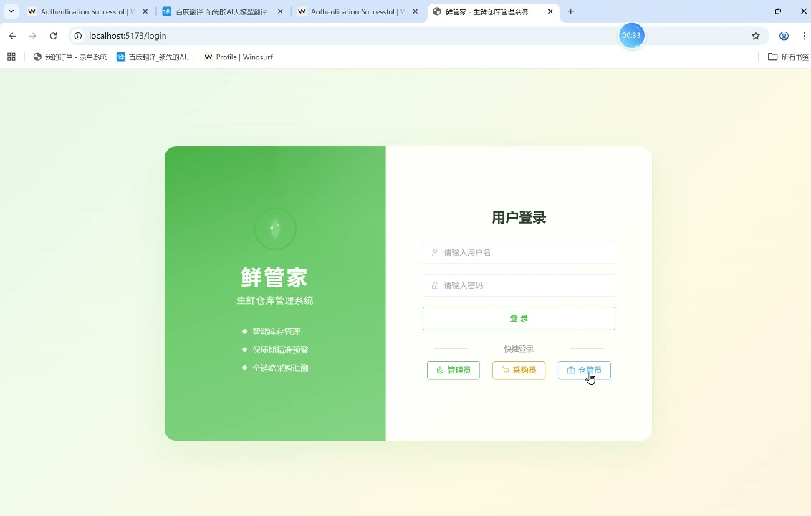
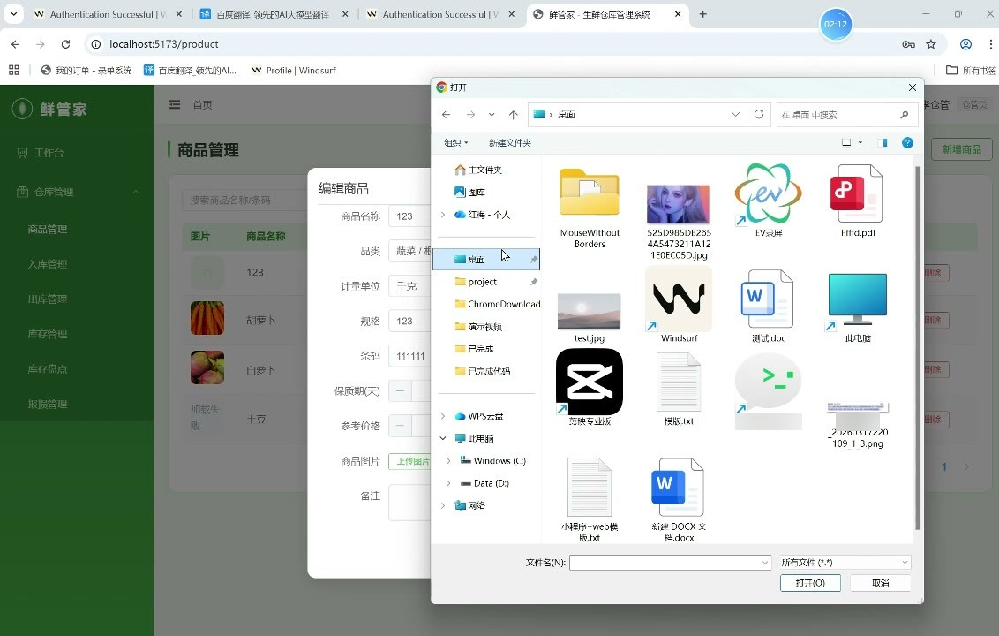
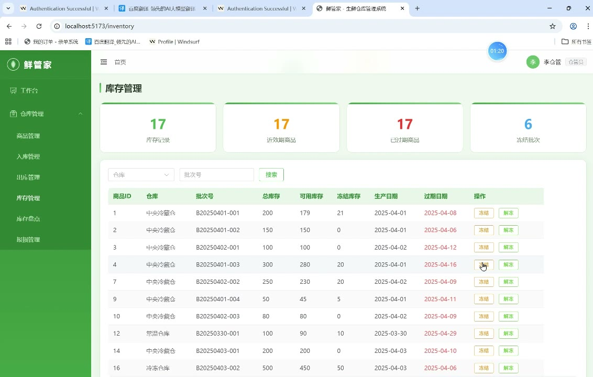
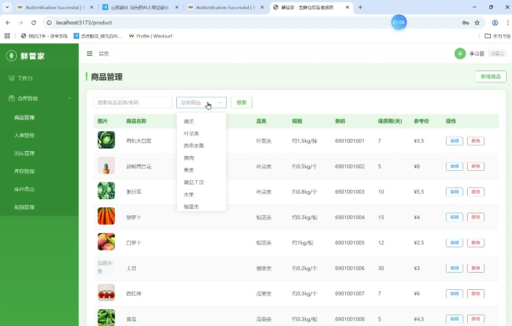
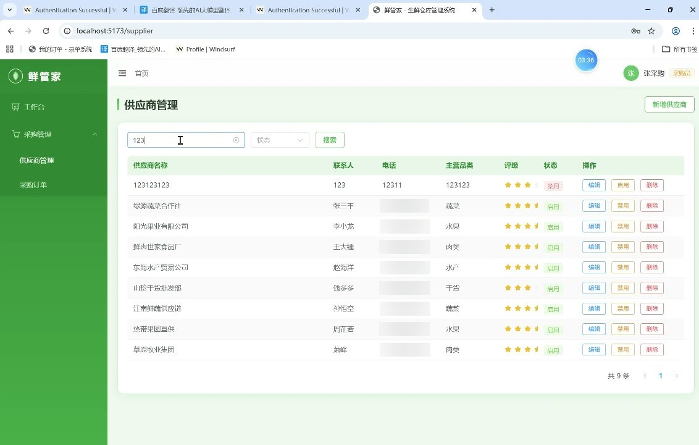
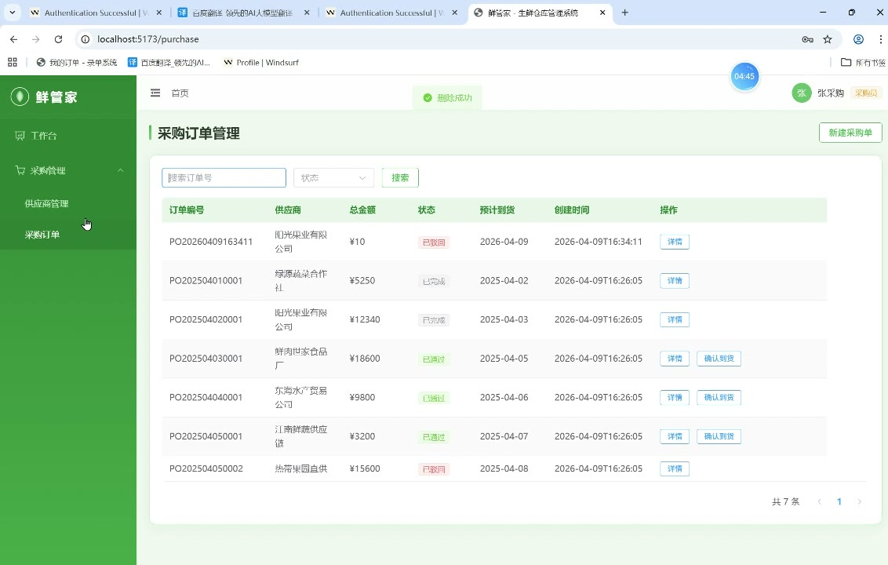

# (附文档)Springboot3+Vue3+MySQL 生鲜仓库管理系统

**技术栈**：Springboot3、Vue3、MySQL

### 系统简介

本系统是一套基于 Spring Boot 3 + Vue 3 + MySQL 的生鲜仓库管理解决方案，采用前后端分离架构。系统提供管理员与操作员两种角色，覆盖供应商管理、采购订单管理、入库/出库操作、库存盘点、损毁报备、库存预警及多维度数据报表等核心业务流程，适用于生鲜食品、冷链仓储等对批次和保质期有严格要求的行业。
 
### 核心功能
 
### 普通用户端

 
- 查看仪表盘概览，实时展示商品总数、仓库总数、供应商总数、待处理采购单数、待审核入库单数、待审核出库单数、临期商品数量及过期商品数量。 
- 按关键字（商品名称/条码）或分类筛选商品列表，查看商品详情（名称、分类、规格、条码、保质期、图片、单价、状态）。 
- 新增采购订单，填写供应商、期望到货日期、备注，并逐条添加采购商品（选择商品、填写数量、单价、批次号），系统自动计算订单总金额。 
- 编辑待审核或已驳回的采购订单，支持修改供应商、期望到货日期、备注及全部商品明细。 
- 查看采购订单详情，包括订单头信息（状态、供应商、金额、日期）和商品明细列表。 
- 发起入库申请，选择入库类型（采购入库/退货入库/调拨入库等）、来源单号、目标仓库，并逐条添加入库商品（商品、数量、批次号、生产日期、保质期）。 
- 发起出库申请，选择出库类型（销售出库/报损出库/调拨出库等）、源仓库，并逐条添加出库商品（商品、数量、批次号）。 
- 创建盘点单，选择盘点类型（全盘/抽盘）、仓库、商品分类，并逐条录入商品的系统数量与实际数量，系统自动计算差异数量。 
- 提交损毁报备单，填写仓库、商品、数量、金额、损毁原因及原因说明，系统自动生成报备编号并置为待审核状态。 
- 查看库存列表，按商品、仓库或批次号筛选，显示总数量、可用数量、冻结数量、生产日期、保质期、入库时间。 
- 查看临期商品列表（默认7天内到期）和过期商品列表，按到期日期排序。 
- 查看供应商列表，支持按名称/联系人关键字或状态筛选，可查看供应商详情（联系人、电话、地址、主营品类、评级）。 
- 查看仓库列表，显示仓库名称、地址、管理员、电话、容量、温度、状态。 
- 查看商品分类树形结构（两级分类），支持按父分类筛选子分类。 
- 查看系统字典数据，按字典类型分组查看键值对。 
- 查看个人登录信息（用户名、真实姓名、角色、头像）。
 
### 管理员端

 
- 管理所有用户账号，支持分页查询、按用户名/真实姓名或角色筛选、新增用户（加密密码）、编辑用户、删除用户、重置密码为“123456”、启用/禁用账号。 
- 管理商品分类，支持新增、编辑、删除分类（含父分类关联校验），分类排序及状态设置。 
- 管理商品信息，支持新增、编辑、删除商品，设置商品名称、分类、计量单位、规格、条码、保质期（天）、图片、单价、状态及备注。 
- 管理计量单位，支持新增、编辑、删除单位，设置单位名称、符号及状态。 
- 管理仓库信息，支持新增、编辑、删除仓库，设置仓库名称、地址、管理员、电话、容量、温度及状态。 
- 管理供应商信息，支持新增、编辑、删除供应商，设置名称、联系人、电话、地址、主营品类、评级及状态。 
- 审核采购订单，对待审核订单执行通过或驳回操作，记录审核人及审核时间。 
- 确认采购订单到货（仅已通过订单可操作），记录实际到货日期。 
- 完成采购订单，将已到货订单标记为已完成。 
- 审核入库单，对待审核入库单执行通过（自动增加库存记录，含仓库、批次、生产日期、保质期）或驳回操作。 
- 审核出库单，对待审核出库单执行通过或驳回操作。 
- 审核损毁报备单，对待审核报备单执行批准或驳回操作，记录审核人及审核时间。 
- 管理库存预警规则，支持新增、编辑、删除预警，设置商品的最低/最高库存阈值及临期提醒天数。 
- 管理系统字典，支持按字典类型查看、新增、编辑、删除字典键值对，设置排序及状态。 
- 执行库存冻结/解冻操作，对指定库存记录冻结或释放指定数量。 
- 查看并导出采购统计报表（已完成订单总数、总金额）。 
- 查看库存统计报表（按仓库汇总库存数量、总记录数）。 
- 查看损毁统计报表（已批准报备总数、总金额、总数量、按原因分类统计）。 
- 文件上传管理，支持上传图片等文件，返回文件访问URL。
 
### 技术栈

 后端框架Spring Boot 3 ORMMyBatis-Plus 权限认证Spring Security + JWT 前端框架Vue 3 状态管理Vue Router / Pinia（由前端路由推断） 构建工具Vite（由 Vue 3 项目推断） 数据库MySQL 密码加密BCryptPasswordEncoder
 
### 交付内容

 
- 后端完整源码 
- 前端完整源码 
- 数据库初始化脚本 
- 万字文档

## 界面展示

---

## 获取完整源码 + 万字文档

本仓库为项目介绍页。**完整前后端源码、数据库初始化脚本、万字项目文档**，请加微信 `kangkangcode`，或访问 [codekk.top](http://codekk.top) 获取。

可作课程设计 / 毕业设计参考，支持远程部署调试。